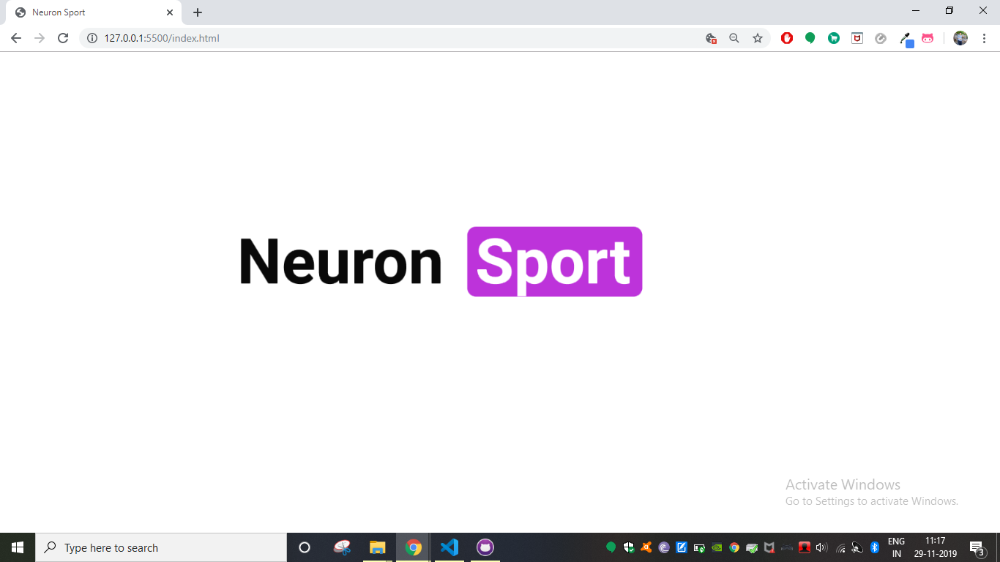
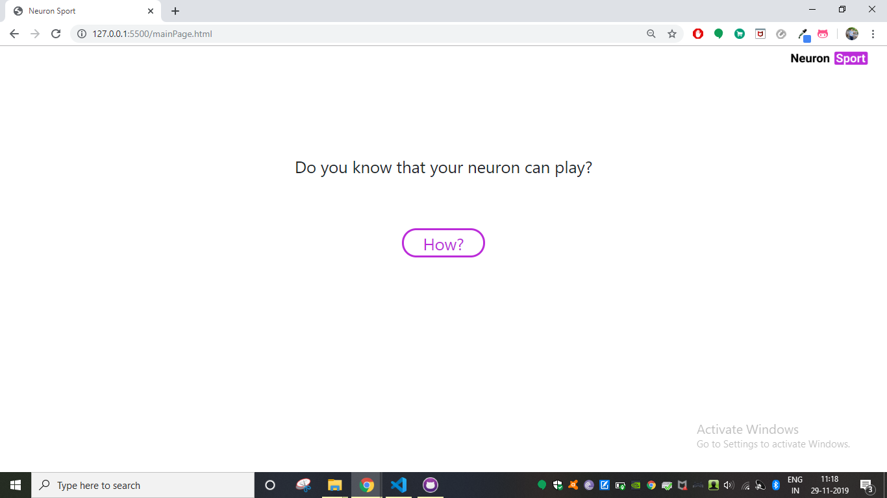
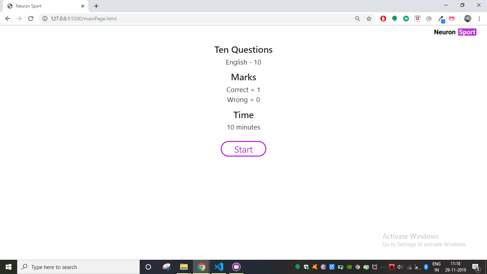
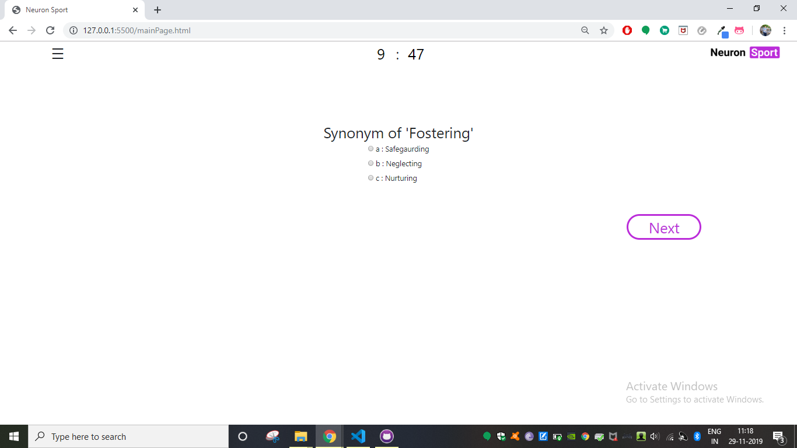
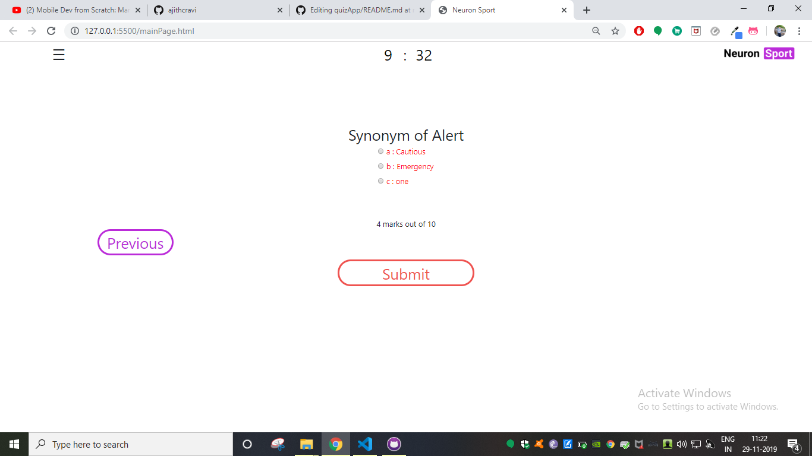
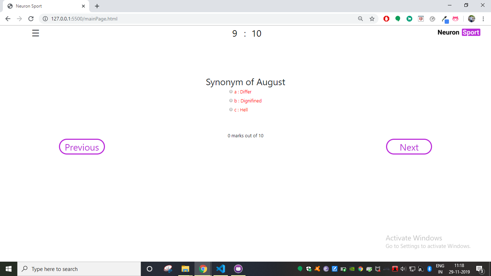

# Quiz App V 1.0.0

Quiz is one of the inevitable sections of education. It helps students to understand and asses the depth they achieved in a particular subject. It is also used as a tool to motivate students towards learning. This application provides a good platform for quiz. In this application, users can attempt 10 questions in 10 minutes. Once submitted, the score is displayed and the user is given a chance to review the answers.

## Getting Started

Follow steps below to download and run this project in local machine
1. Click on 'Clone or download'
2. CLick 'Download ZIP'
3. Extract the .zip file to the preferred location.

### Prerequisites

* html
* css
* javascript
* Bootstrap

## Working

1. Open the index.html to start the application

2. It will then redirect to the main page. Click on the buttons provided to proceed to quiz.

3. Click on start to start the quiz.

4. Answer each question and click on 'Next' to proceed to next question. Click on 'Previous' 

5. 

6. Click on 'Submit' to submit the quiz. THe score will be displayed at the bottom.

7. Review the answers. The controls are similar to that while attempting the quiz.

## Author

[**Ajith C Ravi**](https://github.com/ajithcravi)
